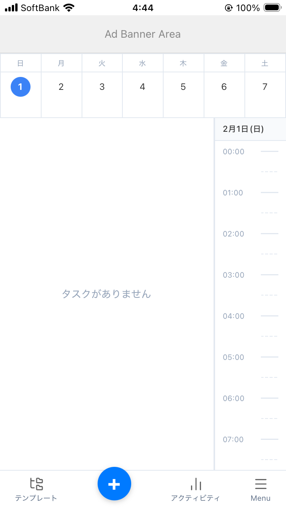
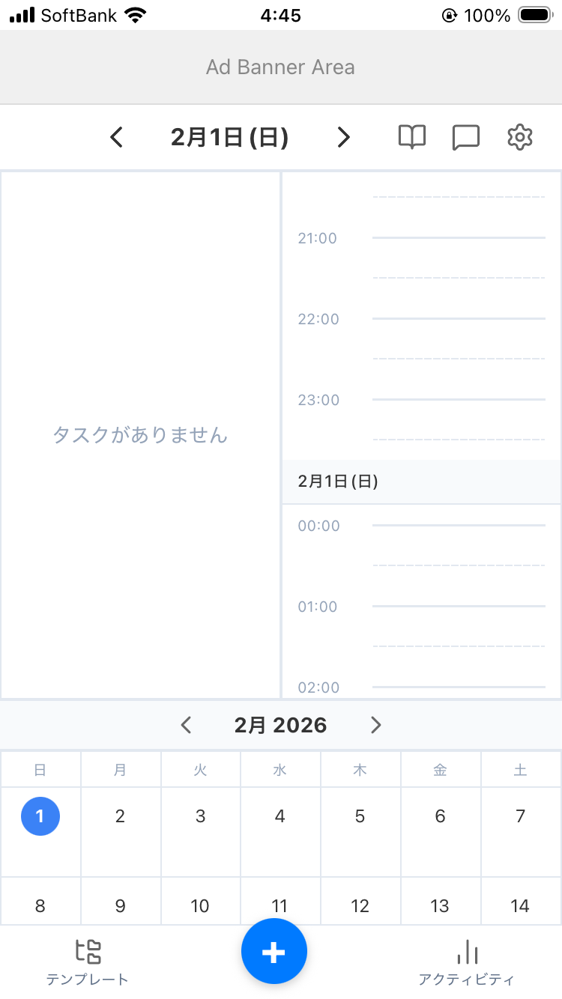
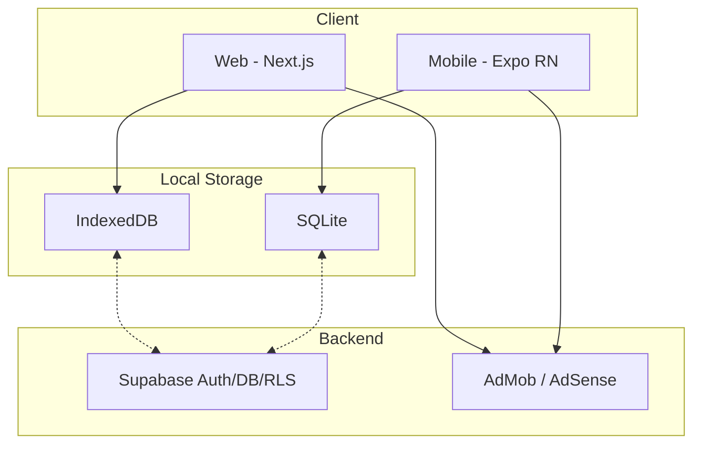

# StudyTodo

タスク管理・スケジュール管理・学習記録・ポモドーロタイマーを統合したデジタルプランナーアプリです。  
Web版とモバイル版のモノレポ構成で開発しています。

**Web**: https://pom-arc-web-wx4z.vercel.app  
**Mobile**: iOS / Android (App Store / Google Play)

| Mobile (Simple) | Mobile (Default) |
|:---:|:---:|
|  |  |

## 主な機能

- **タスク管理** — 作成・編集・カテゴリ分類・ドラッグ&ドロップ並べ替え
- **スケジュール管理** — カレンダー + タイムライン表示
- **ポモドーロタイマー** — タスク連携・画面スリープ防止
- **学習記録 (Journal)** — 日記・振り返り機能
- **アクティビティレポート** — 学習時間・達成率の可視化 (Recharts)
- **テンプレート** — 定型タスクの一括作成
- **多言語対応** — 35言語 + RTL (アラビア語, ウルドゥー語, ペルシア語, ヘブライ語)
- **テーマ** — ライト / ダーク / ペーパーテーマ3種 + アクセントカラー設定
- **オフラインファースト** — ローカルDB完結、Pro版でクラウド同期

## アーキテクチャ

```
studytodo/
├── apps/
│   ├── web/          # Next.js + Dexie.js (IndexedDB)
│   └── mobile/       # Expo (React Native) + SQLite
├── packages/
│   └── shared/       # 共通ロジック・型定義
└── docs/             # 設計書・ダイアグラム
```



## 技術スタック

| カテゴリ | 技術 |
|---------|------|
| Web | Next.js, React 19, TypeScript, Tailwind CSS, Dexie.js (IndexedDB) |
| Mobile | React Native, Expo (SDK 54), SQLite, EAS Build |
| 共通 | Supabase (Auth / Database / RLS), next-intl / expo-localization |
| テスト | Vitest, React Testing Library |
| CI/CD | GitHub Actions, Vercel (Web), EAS Build (Mobile) |
| その他 | Recharts, Lucide Icons, html-to-image |

## 開発のこだわり

- **オフラインファースト設計** — Web は IndexedDB (Dexie.js)、Mobile は SQLite で全操作がローカル完結
- **モノレポ共通化** — 型定義・バリデーション・ユーティリティを `packages/shared` に集約
- **35言語 i18n** — 翻訳キー管理・RTL レイアウト対応 (論理プロパティへの全面移行)
- **テスト** — ビジネスロジック・カスタムフック・設定バリデーションのユニットテスト
- **設計ドキュメント** — ER図・シーケンス図・画面遷移図・アーキテクチャ図を Mermaid で管理

## セットアップ

```bash
# 依存関係のインストール
npm install

# Web 開発サーバー
cd apps/web && npm run dev

# Mobile 開発サーバー
cd apps/mobile && npx expo start
```

環境変数の設定が必要です。`.env.example` を参照してください。

## ライセンス

[MIT](LICENSE)
