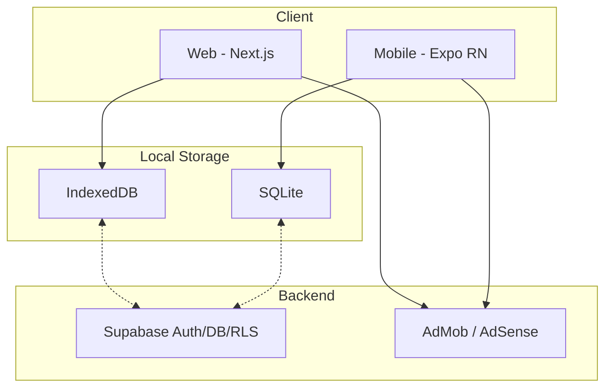

# StudyTodo


[](https://opensource.org/licenses/MIT)

タスク管理・スケジュール管理・学習記録・ポモドーロタイマーを統合したデジタルプランナーアプリです。  
Web版とモバイル版のモノレポ構成で開発しています。

**🔗 Web**: https://pom-arc-web-wx4z.vercel.app  
**📱 Mobile**: iOS / Android (App Store / Google Play 配信中)

| Mobile (Simple) | Mobile (Default) |
|:---:|:---:|
|  |  |

## 💡 開発の背景と目的 (Motivation)

「学習とタスク管理を別々のアプリで管理したくない」という自分自身の課題解決からスタートしたプロジェクトです。
既存のツールでは、タスク管理、ポモドーロタイマー、学習日記（振り返り）がそれぞれ独立しており、包括的な自己管理ができない不便さを感じていました。
そこで、**「記録、計測、計画これ一つ」**をコンセプトに、学習者が生産性を最大化できる統合型ツールを目指して開発しました。また、日常的な学習を妨げないよう、オフラインファーストでの動作による高速なレスポンスにこだわっています。

## ✨ 主な機能

- **タスク管理** — 作成・編集・カテゴリ分類・ドラッグ&ドロップ並べ替え
- **スケジュール管理** — カレンダー + タイムライン表示
- **ポモドーロタイマー** — タスク連携・画面スリープ防止
- **学習記録 (Journal)** — 日記・振り返り機能
- **アクティビティレポート** — 学習時間・達成率の可視化 (Recharts)
- **テンプレート** — 定型タスクの一括作成
- **多言語対応** — 35言語 + RTL (アラビア語, ウルドゥー語, ペルシア語, ヘブライ語)
- **テーマ** — ライト / ダーク / ペーパーテーマ3種 + アクセントカラー設定
- **オフラインファースト** — ローカルDB完結、Pro版でクラウド同期

## 🚀 技術的な課題と工夫した点 (Challenges & Solutions)

本プロジェクトでは、本格的なアプリ運用を見据え、以下の技術的課題に挑戦しました。

1. **オフラインファーストとデータ同期**
   - **課題**: ネットワーク環境に依存せずアプリを高速動作させつつ、複数デバイス間でのデータ整合性を保つ必要がありました。
   - **解決**: Webは IndexedDB (Dexie.js)、モバイルは SQLite を採用し、全操作をローカルで完結。バックグラウンドで Supabase との差分同期を行う仕組みを構築しました。
   
2. **WebとMobileのモノレポ（関心の分離）**
   - **課題**: Next.js(Web)と Expo(Mobile)間でロジックが重複し、保守コストが増大する懸念がありました。
   - **解決**: `packages/shared` 領域を作成し、型定義、バリデーション、時刻処理などの純粋なドメイン知識を分離・集約。UIコンポーネントのみを各プラットフォームで実装する効率的なアーキテクチャを実現しました。

3. **グローバル展開を見据えた UI設計・多言語対応**
   - **課題**: 35言語への対応や、アラビア語などの右横書き（RTL）への対応によるレイアウト崩れ。
   - **解決**: 翻訳キーの一元管理に加え、CSSの論理プロパティ（Logical Properties）への全面移行を行い、安全にスケールするレイアウト構造を構築しました。

## 🏗 アーキテクチャ

```
studytodo/
├── apps/
│   ├── web/          # Next.js + Dexie.js (IndexedDB)
│   └── mobile/       # Expo (React Native) + SQLite
├── packages/
│   └── shared/       # 共通ロジック・型定義
└── docs/             # 設計書・ダイアグラム
```



## 🛠 技術スタック

| カテゴリ | 技術 |
|---------|------|
| **Web** | Next.js, React 19, TypeScript, Tailwind CSS, Dexie.js (IndexedDB) |
| **Mobile** | React Native, Expo (SDK 54), SQLite, EAS Build |
| **共通** | Supabase (Auth / Database / RLS), next-intl / expo-localization |
| **テスト** | Vitest, React Testing Library |
| **CI/CD** | GitHub Actions, Vercel (Web), EAS Build (Mobile) |

## 🧪 開発プロセス・品質保証

単なる個人開発にとどまらず、**チーム開発**・長期運用を意識したルール作りを行っています。

- **チーム開発を想定したガイドライン**: [DEVELOPMENT_GUIDE.md](docs/DEVELOPMENT_GUIDE.md) にて、共有コードの追加ルールやPRチェックリストを明文化。
- **品質管理**: 複雑なビジネスロジックやカスタムフックに対する単体テスト（Vitest）のカバレッジを担保。
- **ドキュメント駆動**: ER図・各画面のシーケンス図・画面遷移図などの設計資料を `docs/` 配下で一元管理。

## ⚙️ セットアップ

```bash
# 依存関係のインストール
npm install

# Web 開発サーバー
cd apps/web && npm run dev

# Mobile 開発サーバー
cd apps/mobile && npx expo start
```

環境変数の設定が必要です。`.env.example` を参照してください。

## 📄 ライセンス

[MIT](LICENSE)
