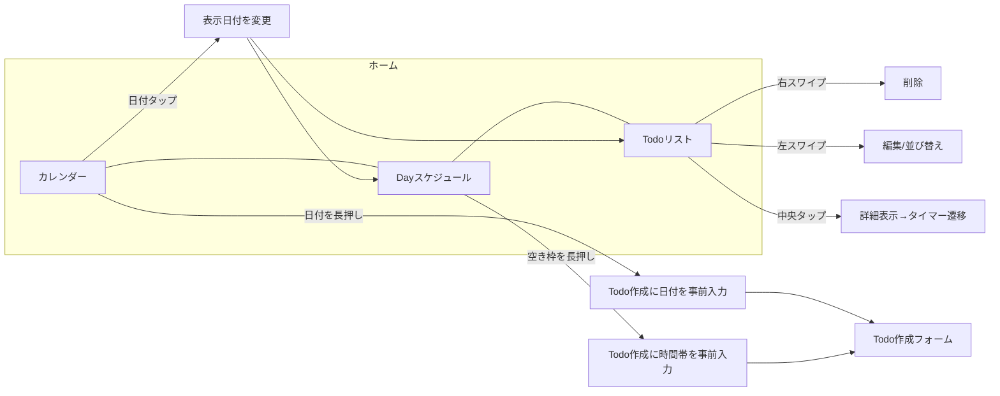

# 02. 主要インタラクションマップ

長押しプレフィル、日付移動、スワイプ操作など、ホーム中心の主要な操作フローです。

```mermaid
flowchart LR
  subgraph Home[ホーム]
    CAL[カレンダー] --- DAY[Dayスケジュール]
    DAY --- TODO[Todoリスト]
  end

  CAL -- 日付タップ --> DateCtx[表示日付を変更]
  DateCtx --> TODO
  DateCtx --> DAY

  CAL -- 日付を長押し --> PrefillDate[Todo作成に日付を事前入力]
  DAY -- 空き枠を長押し --> PrefillTime[Todo作成に時間帯を事前入力]
  PrefillDate --> NewTodo[Todo作成フォーム]
  PrefillTime --> NewTodo

  TODO -- 右スワイプ --> Delete[削除]
  TODO -- 左スワイプ --> EditReorder[編集/並び替え]
  TODO -- 中央タップ --> Detail[詳細表示→タイマー遷移]
```

補足
- 事前入力（プレフィル）は作成効率を高め、日時の入力ミスを減らします。
- 表示日付の変更はTodoとDayスケジュールに即時反映されます。

