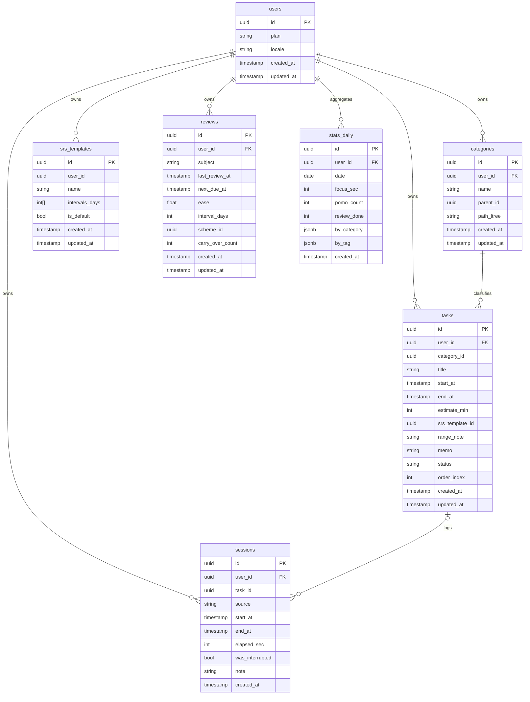

# 03. ER図（概略）

主要エンティティと関係を示します。詳細な型/制約はDBマイグレーションで定義します。

```mermaid
erDiagram
  users ||--o{ tasks : owns
  users ||--o{ categories : owns
  users ||--o{ srs_templates : owns
  users ||--o{ reviews : owns
  users ||--o{ sessions : owns
  users ||--o{ stats_daily : aggregates
  categories ||--o{ tasks : classifies
  tasks o|--o{ sessions : logs

  users {
    uuid id PK
    string plan
    string locale
    timestamp created_at
    timestamp updated_at
  }
  categories {
    uuid id PK
    uuid user_id FK
    string name
    uuid parent_id
    string path_ltree
    timestamp created_at
    timestamp updated_at
  }
  tasks {
    uuid id PK
    uuid user_id FK
    uuid category_id
    string title
    timestamp start_at
    timestamp end_at
    int estimate_min
    uuid srs_template_id
    string range_note
    string memo
    string status
    int order_index
    timestamp created_at
    timestamp updated_at
  }
  srs_templates {
    uuid id PK
    uuid user_id
    string name
    int[] intervals_days
    bool is_default
    timestamp created_at
    timestamp updated_at
  }
  reviews {
    uuid id PK
    uuid user_id FK
    string subject
    timestamp last_review_at
    timestamp next_due_at
    float ease
    int interval_days
    uuid scheme_id
    int carry_over_count
    timestamp created_at
    timestamp updated_at
  }
  sessions {
    uuid id PK
    uuid user_id FK
    uuid task_id
    string source
    timestamp start_at
    timestamp end_at
    int elapsed_sec
    bool was_interrupted
    string note
    timestamp created_at
  }
  stats_daily {
    uuid id PK
    uuid user_id FK
    date date
    int focus_sec
    int pomo_count
    int review_done
    jsonb by_category
    jsonb by_tag
    timestamp created_at
  }
```

補足
- categoriesは階層型（parent_id/path_ltree）で分類を表現します。
- stats_dailyは[Pro]向け集計テーブルで、履歴表示はsessionsから直接参照します。

