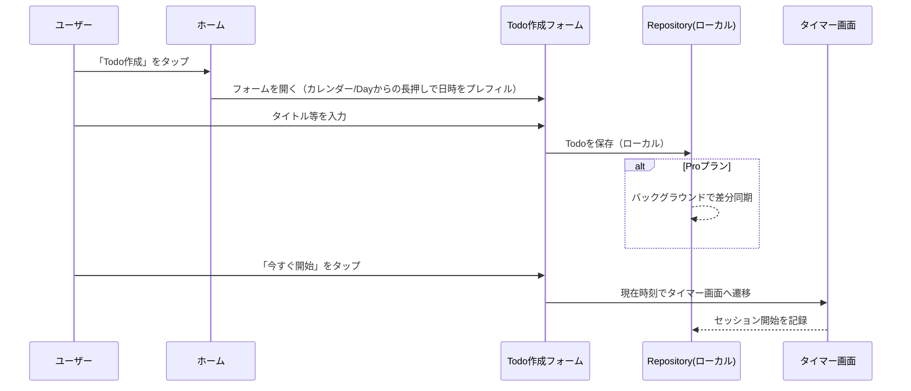

# 04. シーケンス（Todo作成→タイマー開始）

```mermaid
sequenceDiagram
  participant U as ユーザー
  participant H as ホーム
  participant F as Todo作成フォーム
  participant R as Repository(ローカル)
  participant T as タイマー画面

  U->>H: 「Todo作成」をタップ
  H->>F: フォームを開く（カレンダー/Dayからの長押しで日時をプレフィル）
  U->>F: タイトル等を入力
  F->>R: Todoを保存（ローカル）
  alt Proプラン
    R-->>R: バックグラウンドで差分同期
  end
  U->>F: 「今すぐ開始」をタップ
  F->>T: 現在時刻でタイマー画面へ遷移
  T-->>R: セッション開始を記録
```

補足
- 保存はローカルFirst。Proはバックグラウンド同期が有効になります。

