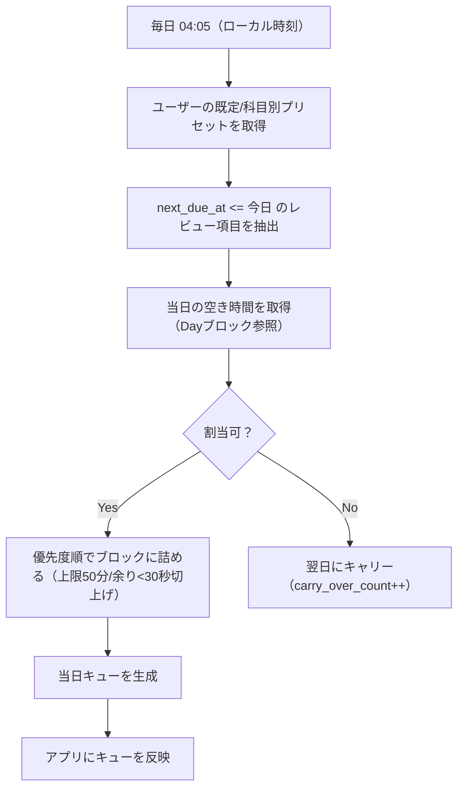

# 06. SRS復習キュー生成フロー

```mermaid
flowchart TB
  T0[毎日 04:05（ローカル時刻）] --> T1[ユーザーの既定/科目別プリセットを取得]
  T1 --> T2[next_due_at <= 今日 のレビュー項目を抽出]
  T2 --> T3[当日の空き時間を取得（Dayブロック参照）]
  T3 --> T4{割当可？}
  T4 -- Yes --> T5[優先度順でブロックに詰める（上限50分/余り<30秒切上げ）]
  T5 --> T6[当日キューを生成]
  T4 -- No --> T7[翌日にキャリー（carry_over_count++）]
  T6 --> T8[アプリにキューを反映]
```

補足
- v1はルールベース割当（AI/ソルバ不使用）。v2以降で最適化の検討余地があります。
- 所要時間の推定は種別ごとに指数移動平均で更新します。

