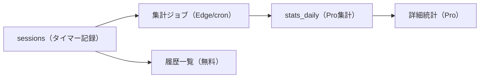

# 07. レポート/集計パイプライン

```mermaid
flowchart LR
  S[sessions（タイマー記録）] --> C[集計ジョブ（Edge/cron）]
  C --> SD[stats_daily（Pro集計）]
  S --> UI1[履歴一覧（無料）]
  SD --> UI2[詳細統計（Pro）]
```

補足
- 無料ユーザーはsessionsから直接履歴を参照、Proはstats_dailyを併用して高速表示します。
- 集計ジョブはUTC基準で起動し、ユーザーのTZ補正を行います。

