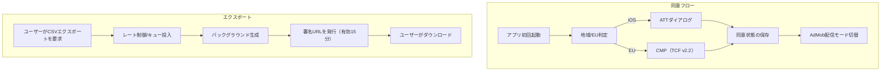

# 08. 同意/広告配信 と エクスポートフロー

```mermaid
flowchart TB
  subgraph Consent[同意フロー]
    A[アプリ初回起動] --> B[地域/EU判定]
    B -->|iOS| C[ATTダイアログ]
    B -->|EU| D[CMP（TCF v2.2）]
    C --> E[同意状態の保存]
    D --> E
    E --> F[AdMob配信モード切替]
  end

  subgraph Export[エクスポート]
    X[ユーザーがCSVエクスポートを要求] --> Y[レート制御/キュー投入]
    Y --> Z[バックグラウンド生成]
    Z --> L[署名URLを発行（有効15分）]
    L --> U[ユーザーがダウンロード]
  end
```

補足
- 同意フローはプラットフォーム/地域により提示内容が異なります。保存済み同意に基づきAdMobの配信モードが変化します。
- エクスポートは重い処理のためバックグラウンド生成し、署名URLで安全に配布します。

