# StudyTodo 画面遷移図
> 作成日: 2026-03-21

---

## 全体フロー

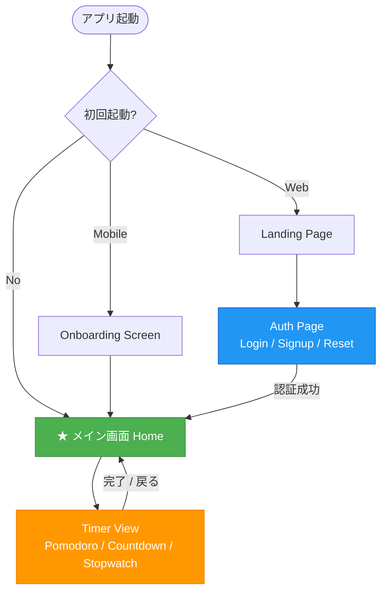

---

## Web版 画面遷移図

### ページルーティング

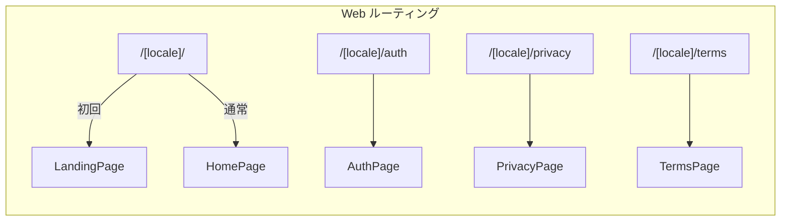

### メイン画面の構成

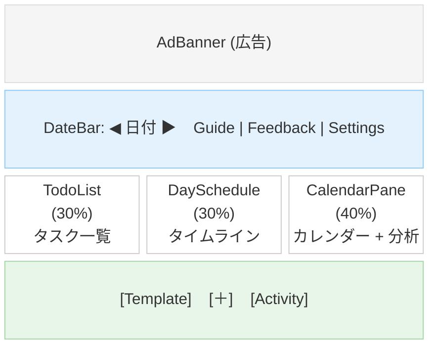

### モーダル遷移図

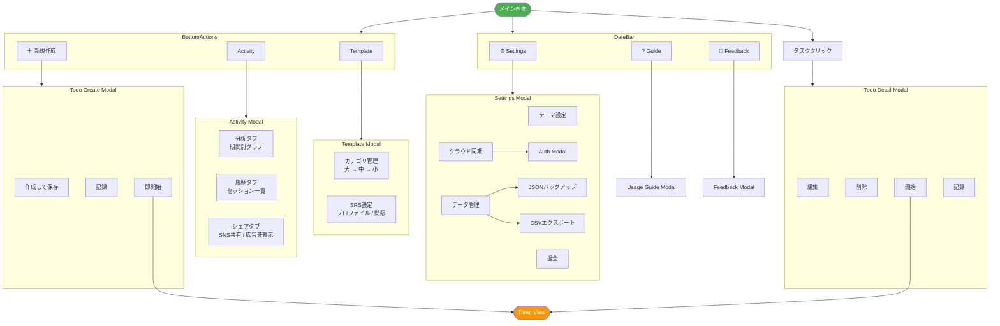

### 認証ページの状態遷移

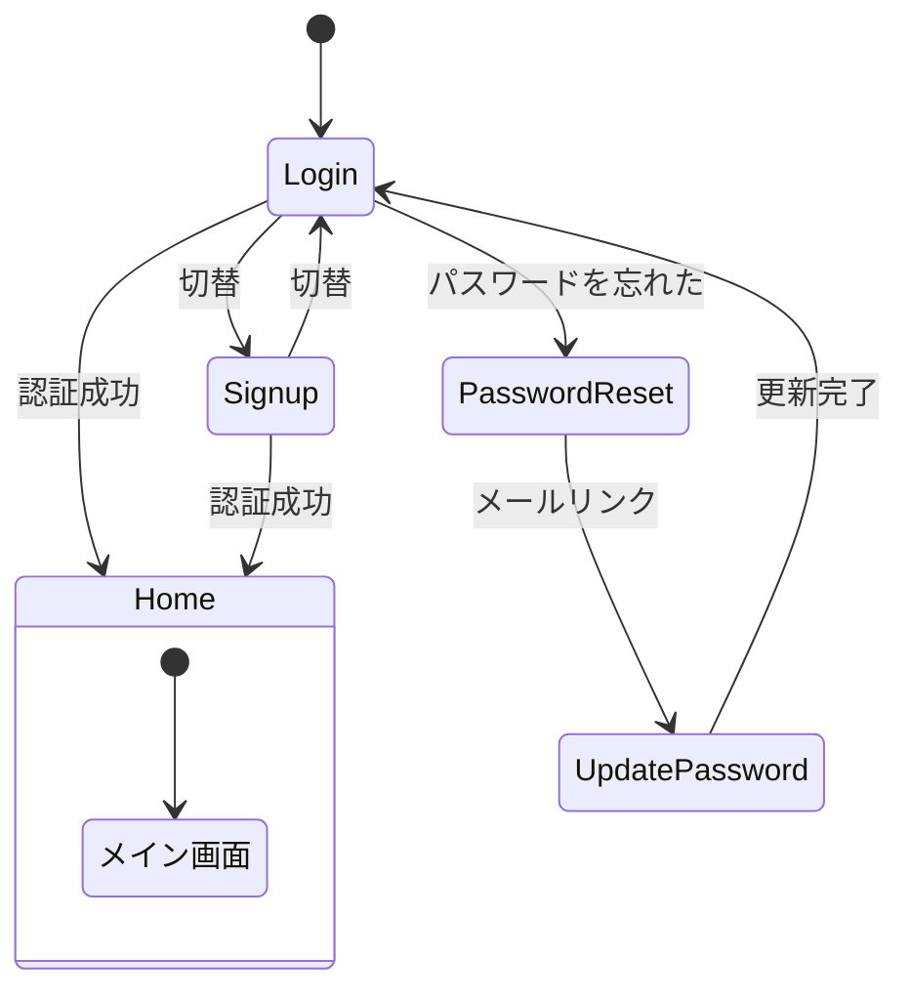

---

## Mobile版 画面遷移図

### 起動フロー

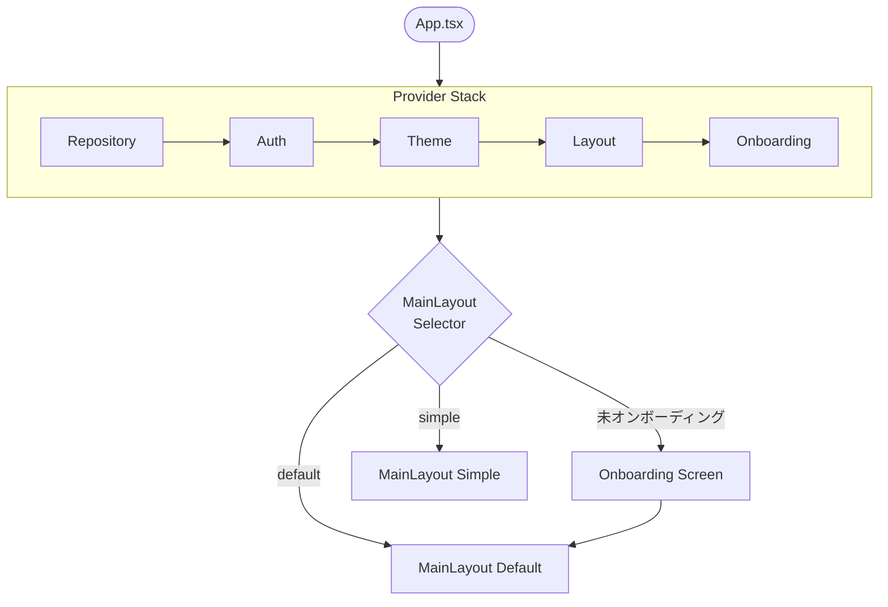

### デフォルトレイアウト

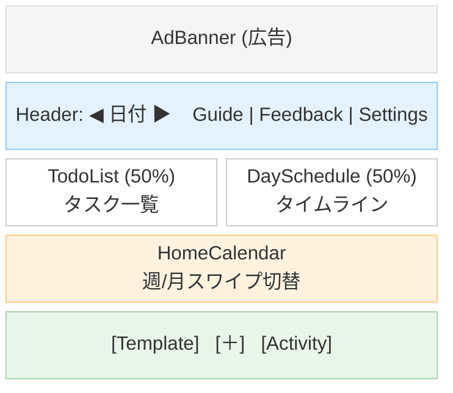

### シンプルレイアウト

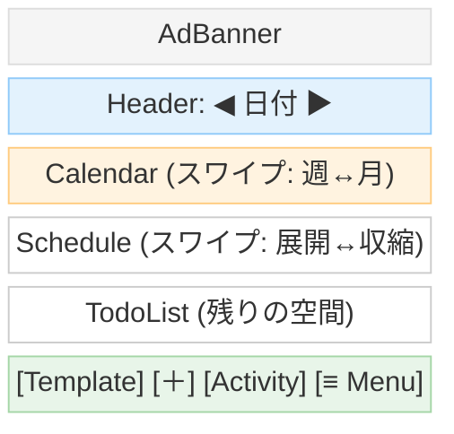

### モーダル遷移図 (Mobile)

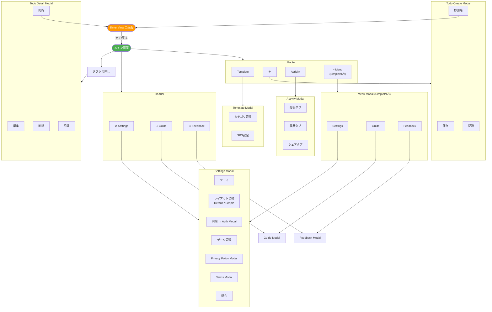

---

## TemplateModal 内部構成

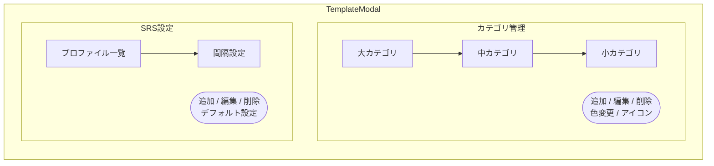

---

## ActivityModal 内部構成

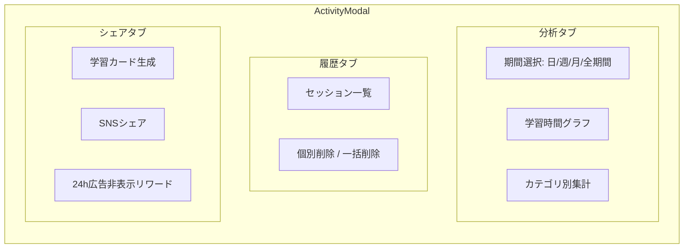

---

## Keep機能の状態遷移

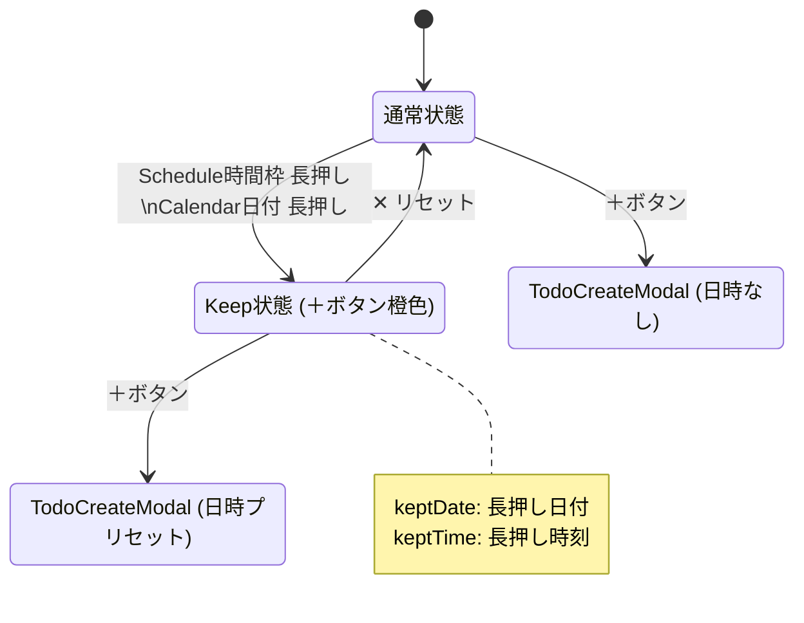

---

## Web版 vs Mobile版 差分

| 項目 | Web版 | Mobile版 |
|------|-------|----------|
| レイアウト | 3パネル固定 | Default / Simple 切替 |
| ナビゲーション | DateBar 上部 | Header 上部 |
| メニュー | DateBar に直接配置 | Default: Header / Simple: MenuModal |
| タスク操作 | クリック | 長押し |
| カレンダー | 月表示固定 | 週/月スワイプ切替 |
| Schedule | 常時表示 | Default: 常時 / Simple: スワイプ展開 |
| Privacy/Terms | 別ページ遷移 | Modal表示 |
| Timer | 画面内切替 | 全画面切替 (viewMode) |
| キーボード | Cmd+N, ESC 対応 | なし |
| 広告 | AdSense (上部固定) | AdMob (上部固定) |
